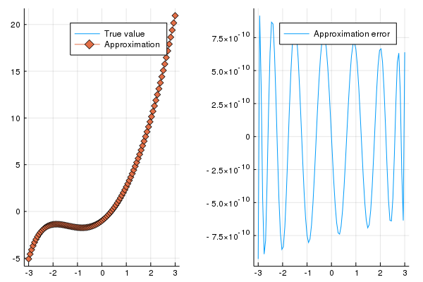
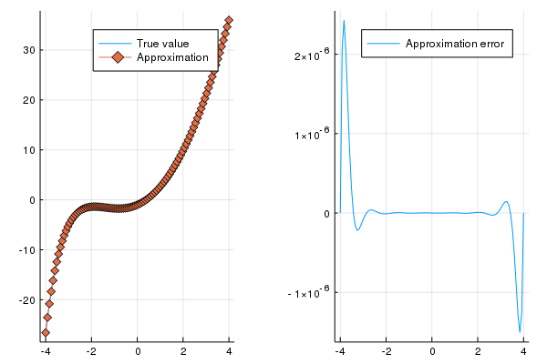
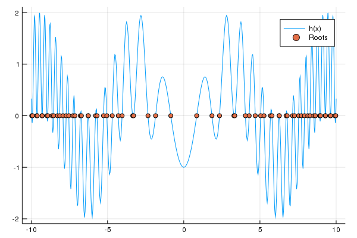
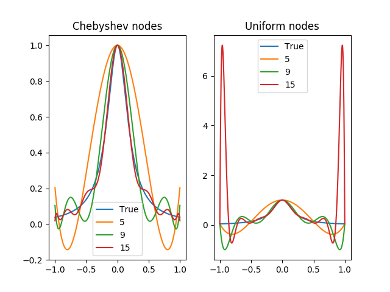
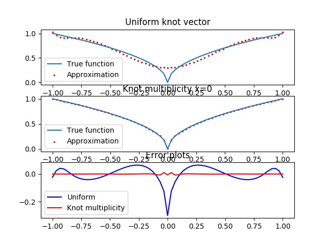
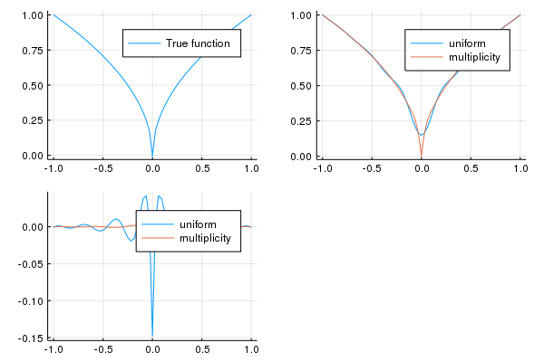

# HWfuncapp

## Plots

* Your plots will show up here below! In the meantime, I put a beautiful [pi](https://www.flickr.com/photos/153311384@N03/) there made by [cormullion](https://cormullion.github.io) for [pi-day](https://cormullion.github.io/blog/2019/03/13/piday.html)

*pi-day!*

*question 1*  

*question 2*  

*question 3*  

*question 4*  

*question 5*  

*question 6*  

*question 7*
